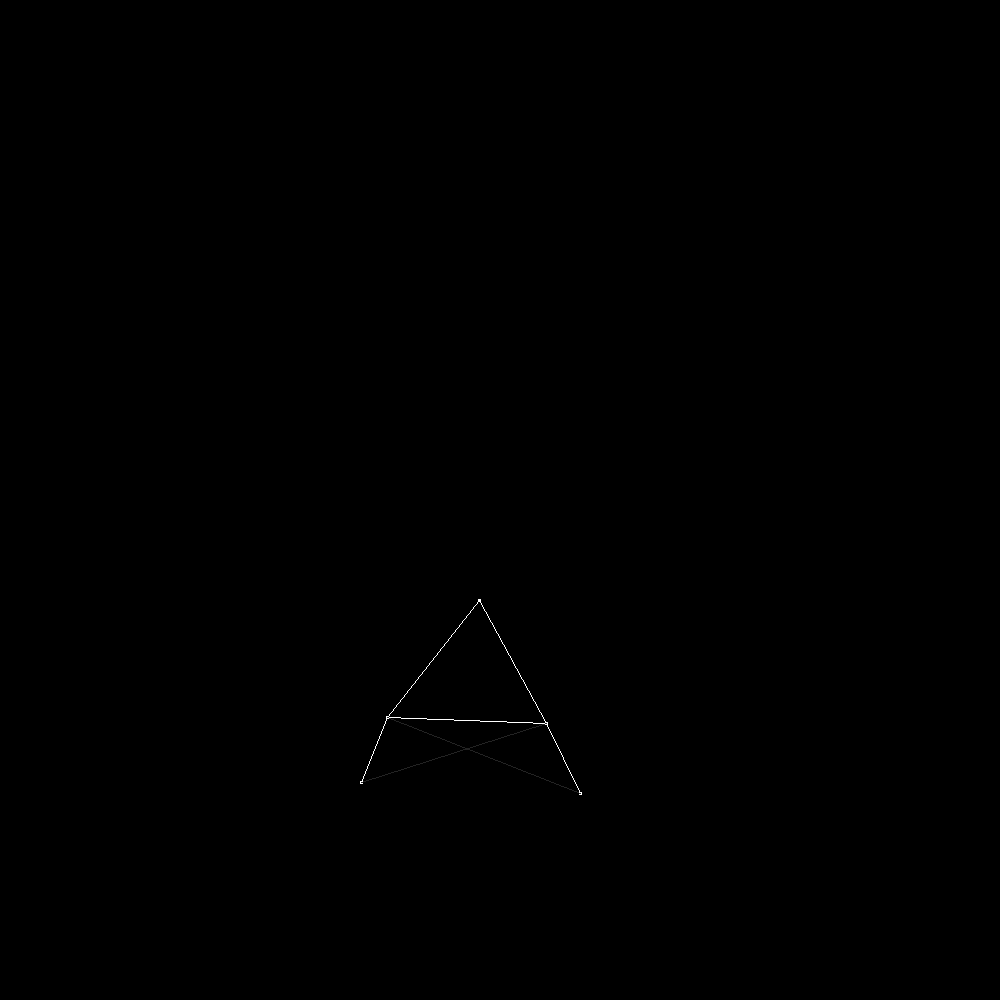
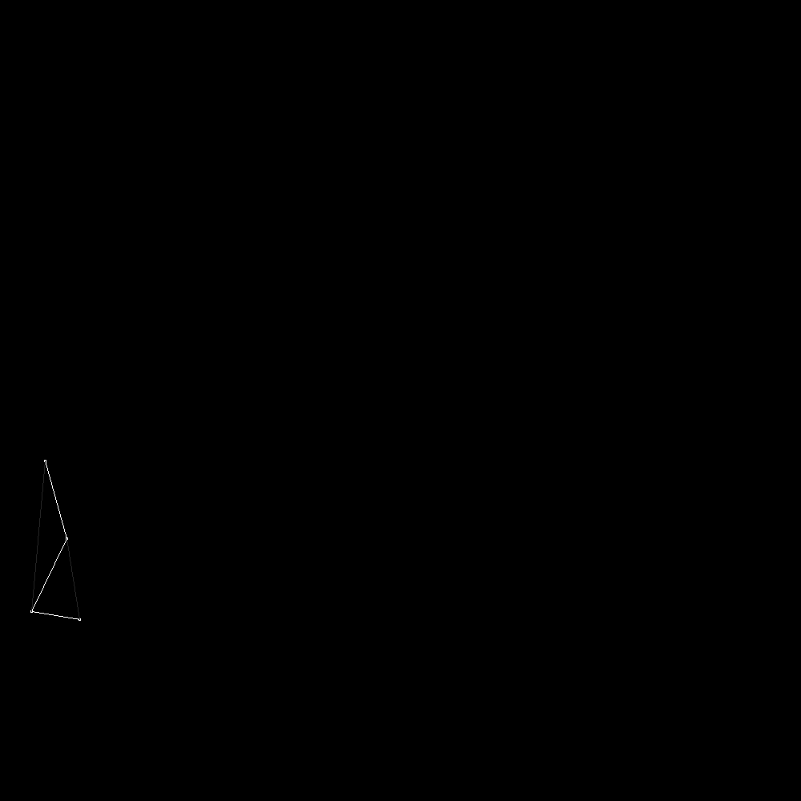
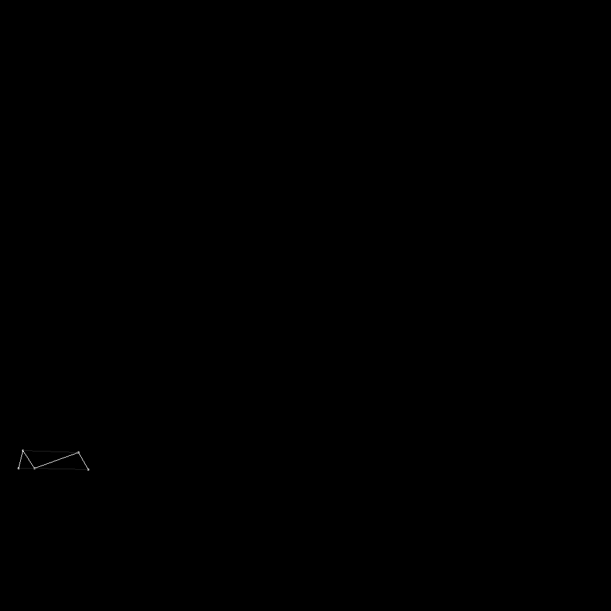

# GeneticAlgorithm

Program in which user-built shapes learn how to walk using neural network brains while also evolving trough genetic algorithm.
First implementation is in python with pytorch, not in real time. 
Second one is in C++ using OpenGL with compute shaders, in real time.

Performance: 
  - 4.000.000 shapes drawn at 60FPS
  - 1.000.000 shapes drawn at 60FPS including physics calculation for each one
  - 100.000   shapes drawn at 60FPS including physics,neural network passes and evolution for each one. (n^3 matrix multiplication, could be much faster)

## Examples
This is a visualization of generations of creatures.
As time progresses they become better and better at going
to the right.

### Python - PyTorch

the left column is the best creature of the generation,
the right column is the sample of the population
<table>
  <tr>
    <td>
        
    </td>
    <td>
        
    </td>
  </tr>
  <tr>
    <td>
        
    </td>
    <td>
        
    </td>
  </tr>
  <tr>
    <td>
        
    </td>
    <td>
        
    </td>
  </tr>
  <tr>
    <td>
        
    </td>
    <td>
        
    </td>
  </tr>
</table>

### C++ - OpenGL

Spiders

https://github.com/P3RK4N/GeneticAlgorithm/assets/87949029/9b1ab6ad-b628-4106-bb74-d903f6b52daa

Bipeds

https://github.com/P3RK4N/GeneticAlgorithm/assets/87949029/e2ae7189-28bd-4e3d-a8db-f9f79c2b5fe9

